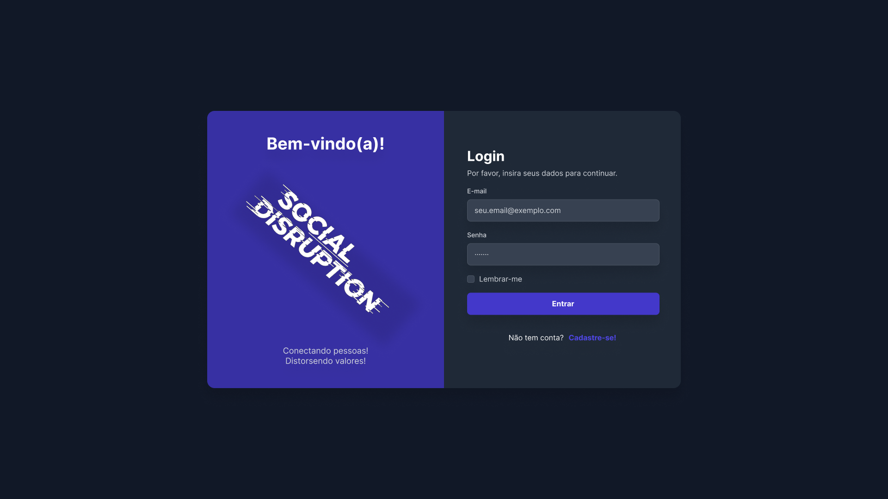
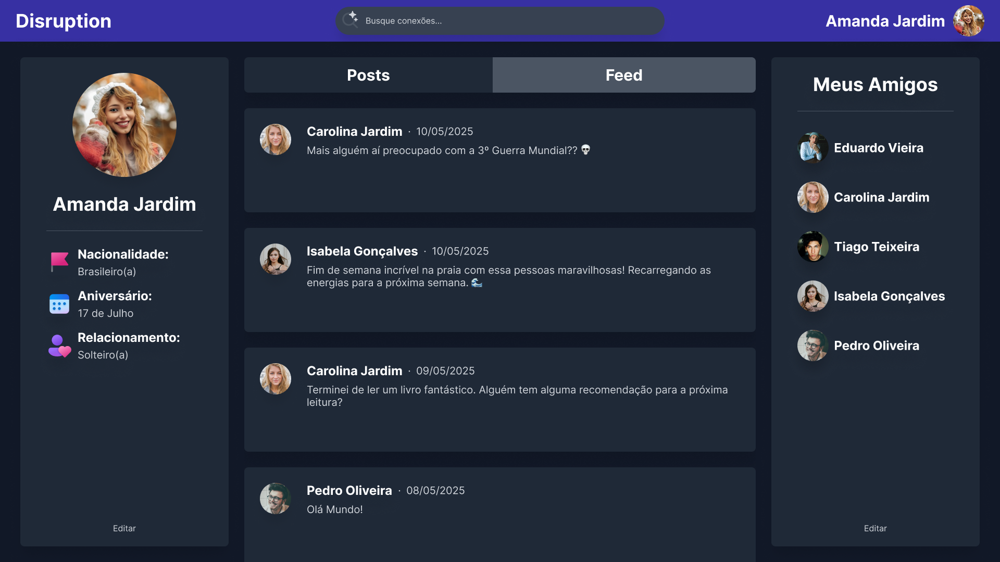
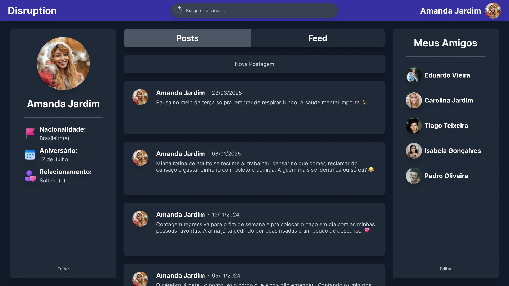
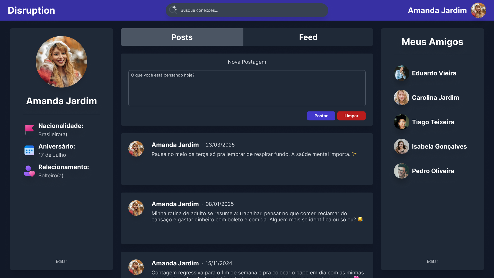
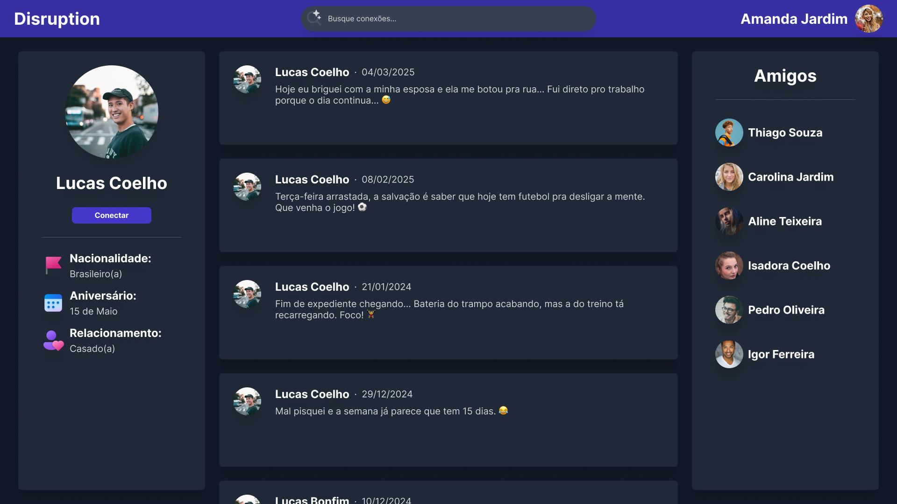

# SocialDisruption

# **CSI606-2025-01 - Proposta de Trabalho Final**

## *Discente: Franklin Liesner Tomich*

<!-- Descrever um resumo sobre o trabalho. -->

### Resumo

Uma rede social simples para o trabalho final de Sistemas Web I, onde os usuários poderão criar e editar seu perfil, procurar por outros usuários e enviar solicitações de amizade, gerenciar sua lista de amigos, publicar postagens e acompanhar as atualizações de seus amigos, e, talvez, mais algumas coisas que a criatividade e o tempo permitirem.

<!-- Apresentar o tema. -->
### 1. Tema

  Uma rede social simples desenvolvida usando tecnologias web.

<!-- Descrever e limitar o escopo da aplicação. -->
### 2. Escopo

Este projeto terá as seguintes funcionalidades:

- Criação de conta e perfil;
- Gerenciamento de perfil;
- Busca de usuários;
- Solicitações de amizades;
- Gerenciamento de amizades;
- Publicação de postagens;
- Feed de notícias.

<!-- Apresentar restrições de funcionalidades e de escopo. -->
### 3. Restrições

  Neste trabalho não serão considerados:

  - Recursos de curtidas;
  - Recursos de comentários;
  - Publicação de fotos;
  - Publicação de vídeos;
  - Chat entre usuários;
  - Recuperação de conta.

### 4. Protótipos

  <!--Protótipos para as páginas (descrever quais páginas) foram elaborados, e podem ser encontrados em...-->

  
  *Tela de login*

   

  
  *Feed do usuário*

   

  
  *Posts do usuário*

   

  
  *Criação de novo post*

   
  
  
  *Perfil visitado*

<!--### 5. Referências

  Referências podem ser incluídas, caso necessário. Utilize o padrão ABNT.-->
